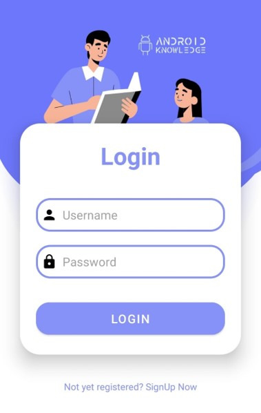
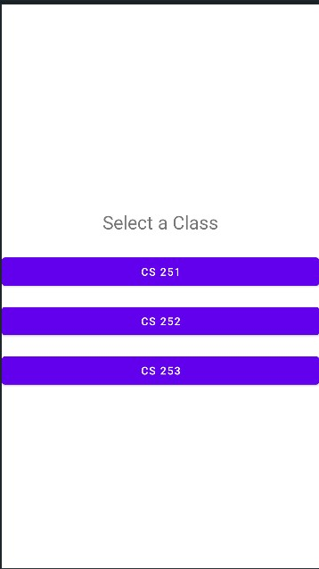
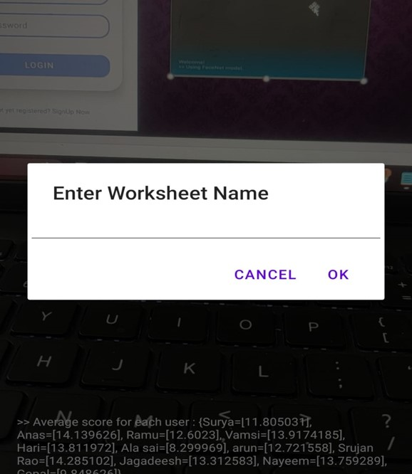

  <h1>Attendance System based on Facial Recogniton</h1>

> **Store images of people who you would like to recognize and the app, using these images, will classify those people. 
We don't need to modify the app/retrain any ML model to add more people ( subjects ) for classification**  

=
=
 
 
### Features

* Asynchronous processing with [Kotlin Coroutines](https://developer.android.com/kotlin/coroutines)
* Use of latest Android development practices with configurable camera facing, GPU usage and mask detection.

---

In this project, we'll use the FaceNet model on Android and generate embeddings ( fixed size vectors ) which hold information of the face.  
  

  
## FaceNet

So, the aim of the FaceNet model is to generate a 128 dimensional vector of a given face. It takes in an 160 * 160 RGB image and   
outputs an array with 128 elements. 
The FaceNet model generates similar face vectors for similar faces.
In this app, we'll generate two such vectors and use a suitable metric to compare them ( either L2norm or cosine similarity ). 
The one which is the closest will form our desired output.  

  
## Usage

The app's startup is a login page

The admin then selects a particular class he wants to check into to mark attendance. Each class click corresponds to `get` request to the flask server endpoint.

  
A user/admin need to store the images of a particular group of students belonging to a class in a directory in Firebase storage bucket. The server accesses then accessese the images of a particular class and and then the bitmap information is sent to app.
The image shows the class hierarchy.

The image refers to the images stored in a particular class. It is recommended to have multiple images of same person in different conditions such as lightning and camera angles. Remember to mark the filename as the student's name or roll number.

After all the students are marked, upon pressing the `stop` button, the app asks the admin to enter a name to the excel file to store the attendance status of the students. The students whose faces are detected are marked `present` and those not detected otherwise.

  
## Working  

  
The app's working is described in the steps below:
  
1. Scan a `class` folder present in the firebase storage. Next, parse all the images present within that folder. A flask server is deployed for this purpose. The flask server stores the images in the form of 64-byte array and then sends this information to the app. The images are then converted to bitmap in the app. 
 We then  Crop the face from the image ( the one which was collected from user's storage ) using the bounding box coordinates.   
  
2. Finally, we have a list of cropped `Bitmap` of the faces present in the images. Next, feed the cropped `Bitmap` to the FaceNet   
model and get the embeddings ( as `FloatArray` ). Now, we create a `HashMap<String,FloatArray>` object where we store the names of   
the sub directories as keys and the embeddings as their corresponding values. 
   

The above procedure is carried out only on the app's startup. The steps below will execute on each camera frame.  
  
1. Using `androidx.camera.core.ImageAnalysis`, we construct a `FrameAnalyser` class which processes the camera frames. Now, for a   
given frame, we first get the bounding box coordinates ( as a `Rect` ) of all the faces present in the frame. Crop the face from   
the frame using these boxes.  
2. Feed the cropped faces to the FaceNet model to generate embeddings for them. We compare the embedding with a suitable metric and
form clusters for each user. We compute the average score for each cluster. The cluster with the best score is our output.
The final output is then stored as a `Prediction` and passed to the `BoundingBoxOverlay` which draws boxes and   
text.  
3. For multiple images for a single user, we compute the score for each image. An average score is computed for each group.
  The group with the best score is chosen as the output. See `FrameAnalyser.kt`.

## Limitations  
  
Predictions may go wrong as FaceNet does not always produce similar embeddings for the same person. 
Consider the accuracy of the FaceNet model while using it in your apps. In that case, you may learn to use the `FaceNetModel` class separating for using FaceNet in some other tasks.  

